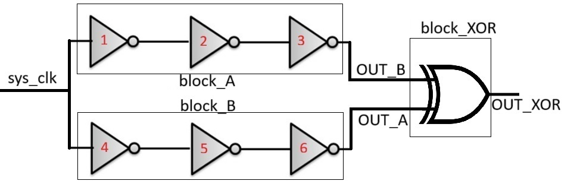
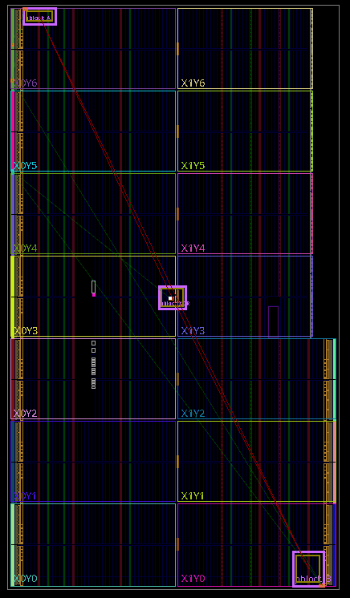

# Inverter-Skew on Genesys-2 (Kintex-7)

**Goal:** Implement two identical 3-inverter chains, drive both with the same stimulus, and measure timing skew (Δt) between their outputs on an oscilloscope. The optional third output shows `XOR(OUT_A, OUT_B)` so pulse width ≈ |Δt|.

**Board:** Digilent Genesys-2 (XC7K325T-2FFG900C).

The design implements two parallel 3-inverter chains, both fed by the same `sys_clk`. Their outputs (`OUT_A` and `OUT_B`) are compared directly, and also combined into `OUT_XOR` so that skew appears as short pulses.



## Measure
- Probe `OUT_A`, `OUT_B`, and `OUT_XOR` with Mixed Signal Oscilloscope 2 Series MSO
- Trigger on `OUT_A`; measure at 25 MHz (max value of the AFG)
- `OUT_XOR` (optional) shows a narrow pulse whose width tracks |Δt|.

```text
OUT_A:   ____/‾‾‾‾‾‾‾‾
OUT_B:   _________/‾‾‾
Δt:         <---->
XOR:     ___/‾‾‾‾\____
```
Here, the XOR pulse width equals the time difference between the two rising edges.

### Device Floorplan
- block_A in the extreme **top‑left**, block_B in the extreme **bottom‑right**, block_XOR centered.
- **A chain** (`A/inv0..2`) fixed at **SLICE_X0Y349** inside **block_A** (top‑left corner).
- **B chain** (`B/inv0..2`) fixed at **SLICE_X153Y0** inside **block_B** (bottom‑right corner).
- **XOR** (`u_xor` LUT2) fixed at **SLICE_X76Y174** inside **block_XOR** (center window X=70..82, Y=168..180).
- Fabric bounds (Kintex‑7 XC7K325T): **X=0..153, Y=0..349**.


<p align="center">
  
  <br>
  <em>Floorplan view showing block_A (top-left), block_B (bottom-right), and XOR (center).</em>
</p>


## Build
Tested with **Vivado 2023.1**

**Open Vivado TCL Console and Run:**  
   ```tcl
   cd <path-to-repo>/scripts
   source create_project.tcl
   source build.tcl
```

- Program the FPGA from **Hardware Manager**.

## Pins
Edit `constraints/genesys2_pins.xdc`:
- Map `sys_clk` to the on-board oscillator pin from the **Genesys-2 Master XDC**.
- Choose two pins in the **same I/O bank** for `OUT_A` / `OUT_B` (and one for `OUT_XOR`).
- Keep identical `IOSTANDARD/DRIVE/SLEW`.

## Waveform View
Tektronix MSO2 is used (`https://www.tek.com/en/datasheet/2-series-mso-mixed-signal-oscilloscope-datasheet`) to measure the skew between `output_A` and `output_B`.
- AFG Setting: Square, 25 MHz, 3.3 Vpp
- Channel 1 (`output_A`): 1.1 V/div, 10X Scope, 70Hz Bandwidth
- Channel 2 (`output_B`): 1.1 V/div, 10X Scope, 70Hz Bandwidth

 
  <p align="center">
  
  <br>
</p>


